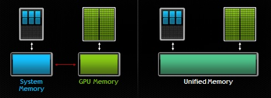

# Unified GPU Memory (UGM)

## [NASA Review of UGM](https://www.nas.nasa.gov/hecc/support/kb/simplifying-gpu-programming-with-unified-memory_703.html)

Starts with *CUDA 6*

`Without the CUDA Unified Memory feature, programming for running on these heterogeneous nodes requires that any data shared between the CPU and the GPU(s) are allocated on both the host memory and the device memory, and explicitly copied between them within the application. This makes programming for such heterogeneous systems error-prone and complicated.`  
  
*Figure 1: Diagram of Unified Memory Architecture vs Standard Mem model.*  
### Two Main Features
 - `It creates a pool of virtual memory (shown in the right graph ) that is a single memory address space accessible through a single pointer from either the CPU or the GPU(s). Mapping of the virtual address to the physical address—invisible to the programmer—is tracked through page table(s).`
 - `It automatically takes care of migrating memory pages to the memory of the accessing processor to enable local access through support from software (CUDA driver, CUDA runtime, and operating system) and/or hardware (such as the page migration engine, hardware access counters, and hardware-accelerated memory coherency).`

## [Nvidia Dev Guide for UGM](https://developer.nvidia.com/blog/unified-memory-cuda-beginners/)